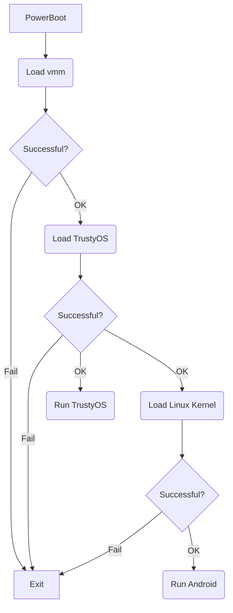

```mermaid
graph TD;
   Start[PowerBoot]-->LoadVmm(Load vmm);
   LoadVmm-->CheckLoadVmm{Successful?}
   CheckLoadVmm--> |Fail| Exit[Exit]
   CheckLoadVmm--> |OK| LoadTrustyOS(Load TrustyOS)
   LoadTrustyOS--> CheckLoadTrustyOS{Successful?}
   CheckLoadTrustyOS--> |Fail| Exit[Exit]
   CheckLoadTrustyOS--> |OK| RunTrustyOS(Run TrustyOS)
   CheckLoadTrustyOS--> |OK| LoadKernel(Load Linux Kernel)
   LoadKernel--> CheckLoadKernel{Successful?}
   CheckLoadKernel--> |Fail| Exit[Exit]
   CheckLoadKernel--> |OK| RunAndroid(Run Android)
```

